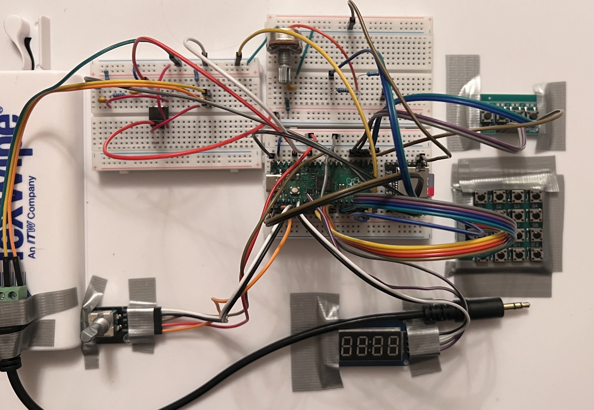

# PAT — Portable Audio Tool (Sampler/Sequencer/Synth)

  

A standalone, hardware-based sampler and digital synthesizer built around the RP2040 microcontroller. Designed for real-time musical performance and DIY audio exploration. Developed in MicroPython, with integrated analog effects and a full sequencer UI.

# Features

- Sample playback with 16 step ( 8x2 ) grid sequencer and visualizer ( DFR0229 )
- Digital synth engine ( DDS-based ) with triangle, saw, square, and sine waveforms
- PWM audio output with ( RC ) bandpass filtering
- Encoder-based control of waveform, envelope, and FX parameters
- Transistor-based analog tremolo ( LFO modulated )
- Mode-switchable SYNTH / SAMPLE engine with combined audio out ( active summing )
- Midi & sync output support via 3.5mm TRS ( type-B )
- Open-source firmware, hardware, and enclosure design
- 2 keypads, 20 buttons ( 16 for note/sample playback, 4 for UI )
- Encoder knob for menu navigation and SYNTH control modes
- 7-segment display with fully populated menu and visual queues
- 3D printed case, fully assembled with snap-fit standoffs

# Folder Overview

- `/firmware`: MICROPYTHON CODEBASE
- `/hardware`: CIRCUIT DIAGRAMS, 3D MODELS, ETC.
- `/media`: PHOTOS & VIDEOS
- `/docs`: PRINTABLE DATASHEETS

# Technical Highlights

- Real-time waveform synthesis via PWM and timer interrupts
- Synth control modes: CUTOFF, FADE-IN, ASDR ENV, FILTER SWEEP, FILTER MOD, and PITCH BEND
- Modular state machine controlling input, output, and mode logic
- Minimal latency sampling engine using UART protocol and <asyncio>
- Playback speeds of 60-140 bpm ( 16th notes, max of 560 steps per minute )
- Threaded synth logic for DUAL MODE, SYNTH and SEQUENCER combined operation
- Permanent storage of program configuration and sequencer patterns
- Import custom sample banks via micro SD card ( MP3 and WAV )
- Fully documented hardware stack for easy replication

# Demo

SYNC W/ KORG VOLCA

SYNTH CONTROL 1

SYNTH CONTROL 2

# Work in Progress

- SYNTH melody sequencing, by step-based assignment of both rhythmic and melodic values
- Communication of SYNTH sequence values (beat & note) via MIDI-OUT signal
- Analog FX builds : DISTORTION, REVERB, DELAY

---

# Creator

Ken Hill – Embedded Engineer , [somuchfunwithwords@gmail.com](mailto:somuchfunwithwords@gmail.com)

[View my portfolio](https://drive.google.com/drive/folders/13Q4Rg4acVu6Zbi14zaWPo625oAb1vngg?usp=drive_link) | [LinkedIn](https://www.linkedin.com/in/ken-hill-5a03b9225)
